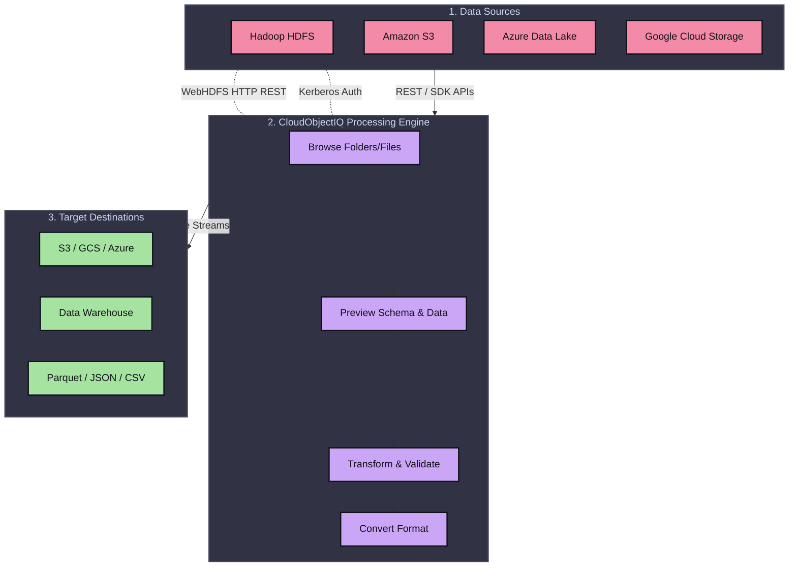
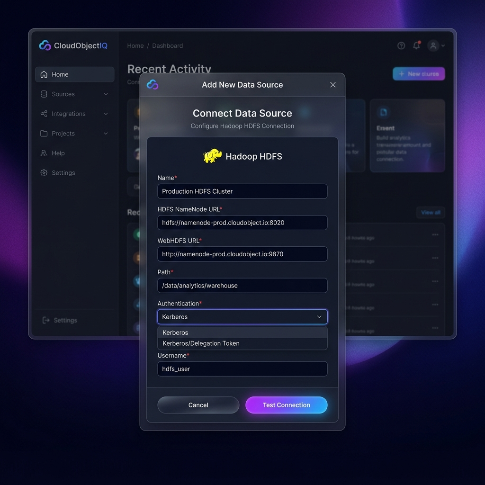

# CloudObjectIQ - Hadoop/HDFS Integration Architecture & Design

This document outlines the proposed architecture, data flow, and user interface for integrating Hadoop HDFS as a primary data source in CloudObjectIQ. This design allows users to connect directly to their Hadoop clusters, eliminating the need for manual file downloads and uploads.

## 1. System Architecture & Data Flow

The integration uses WebHDFS to provide a seamless, REST-based connection between CloudObjectIQ and the enterprise Hadoop cluster.

## 2. Hadoop Connection Screen Design

To give this a premium enterprise feel, we should use a sleek modal or dedicated settings page with modern typography, subtle glassmorphism, and clear field validation.

### UI Component Specification (For Developers)

The UI should follow a standard "Add Data Source" flow.

**1. Modal/Page Title:** Connect Data Source - Hadoop HDFS
**2. Description:** Connect directly to your Hadoop cluster to browse, process, and transfer files without manual downloads.
**3. Form Fields:**
- `Name`: String input (e.g., "Production Hadoop"). *Required*.
- `HDFS NameNode URL`: URL input (e.g., `hdfs://namenode:8020`). *Required*.
- `WebHDFS URL`: URL input (e.g., `https://namenode:9871`). *Required*.
- `Path`: String input representing the root path (e.g., `/data/customer/`). *Required*.
- `Authentication`: Dropdown with options:
  - `Kerberos`
  - `Delegation Token`
  - `Simple` (Optional, for dev environments)
- `Username`: String input. *Required based on Auth type*.
- `Keytab File` (Conditional, shown if Kerberos is selected): File upload component.

**4. Actions:**
- `Test Connection` Button: Triggers a lightweight WebHDFS `GETFILESTATUS` or `LISTSTATUS` API call to the specified path to verify connectivity and authentication.
- `Save Source` Button: Persists the connection settings.

## 3. Product Positioning & User Flow

**The "No-Download" Philosophy**
The core value proposition for this feature is moving away from manual file handling. The UX should reflect this by immediately dropping the user into a file browser for their HDFS cluster once connected.

**The User Journey:**
1. **Connect:** User enters WebHDFS details in the UI above.
2. **Browse:** CloudObjectIQ renders a virtual file explorer using WebHDFS `LISTSTATUS`.
3. **Select:** User clicks a `.parquet` or `.csv` file.
4. **Preview:** System fetches the first few MBs of the file via WebHDFS `OPEN` and renders a schema/data table.
5. **Process:** User applies transformations (rename columns, filter rows, validate types).
6. **Target:** User selects Amazon S3 as the target. CloudObjectIQ streams the data from HDFS directly to S3.
